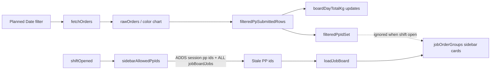

# GSM Production Entry — Full Fix Plan

## Latest user issue (screenshots)

- **Planned Date** changes (23-06, 27-06, 28-06, 30-06) → **Board plan (Kg)** updates correctly.
- **Orders & Jobs sidebar** and **mix rolls** do **not** update — stale cards remain (e.g. `das51`, old `F26223` totals).
- **das51** is queued on **Unit 1** in Production Table (July) but appears on **Unit 2** GSM when shift is open on run date **01-05-2026**.
- Mix rolls: **"No mix rolls planned this month"** even after shift start — operator created Week 27 data on Color Chart.

---

## Root cause — why Board plan changes but sidebar does not



| Component | What it uses | Updates on date change? |
|-----------|--------------|-------------------------|
| **Board plan (Kg)** | `filteredPpSubmittedRows` sum | Yes |
| **Sidebar job cards** | `jobBoardJobs` via polluted `sidebarAllowedPpIds` | **No** — keeps old PP ids |
| **pruneSelectedEntriesToFilter** | `filteredPpIdSet` | **Skipped when `shiftOpened`** |
| **Mix rolls** | `runDate` month (01-05-2026 = **May**) | **Wrong month** vs browse June/Week 27 |

### Code bugs (confirmed)

1. **`sidebarAllowedPpIds`** ([`GsmProductionEntry.vue` ~2868](production_entry/public/js/GsmProductionEntry.vue)) — when shift open, adds `selectedEntries`, `rollLines`, and **all `jobBoardJobs` pp_ids** → circular stale set.

2. **`pruneSelectedEntriesToFilter`** (~3545) — `if (shiftOpened.value) return;` → changing Planned Date while shift open **never removes** old jobs like das51.

3. **`fetchSessionSupplementalOrders`** — merges extra session planned dates into `rawOrders`, keeping old-date orders visible.

4. **`rowMatchesFilterDate`** — session PP bypass can show orders from session dates even when browse date differs.

5. **`loadMixRollCandidates`** — `runDate.value || filterDate.value` → shift on **01-05-2026** searches **May** mixes, not June Week 27.

6. **Unit leak (das51)** — stale `selectedEntries` / job board from wrong unit or date not pruned; strict `row.unit === filterUnit` must apply to sidebar PP set, not only chart filter.

---

## Phase 1 — Unit / session / selection (P0)

**[`GsmProductionEntry.vue`](production_entry/public/js/GsmProductionEntry.vue)**

- Remove silent `tryResumeOpenSessionForUnit({ quiet: true })` on mount.
- Gate locked panel: `shiftOpened && selectionLocked && selectedEntries.length`.
- `clearGsmAfterClose()` + `persistDraft()` skip selection when shift closed.

**[`unified_production_entry_api.py`](production_entry/production_planning/unified_production_entry_api.py)**

- `close_gsm_shift_session`: clear `locked_jobs`, `selection_locked = 0`.

---

## Phase 1B — Planned date + unit sidebar sync (P0) — NEW

**Goal:** Sidebar Orders & Jobs must match **Production Table** for selected **Planned Date + Unit** (daily / weekly / monthly), even when a shift is open on a different **Run Date**.

### Frontend fixes

1. **`sidebarAllowedPpIds`** — use **only** `filteredPpIdSet` (from `filteredPpSubmittedRows`). Remove injection of `jobBoardJobs` / stale session ids. Optional: keep session pp ids **only if** they pass `rowMatchesFilterDate` + unit filter.

2. **`pruneSelectedEntriesToFilter`** — run **even when shift open**; drop entries whose `plannedDate` not in browse scope or `ppId` not in `filteredPpIdSet`; unlock if empty.

3. **`fetchOrders` on filterDate / viewScope / unit change** — always reload job board from fresh `filteredPpIdSet`; call `pruneSelectedEntriesToFilter()` after load.

4. **`jobOrderGroups`** — optionally build cards from `filteredPpSubmittedRows` PP list first, then attach job board rows (so empty job board still shows order shell from Production Table).

5. **Strict unit** — normalize unit via same helper as mix rolls (`normalize_planning_unit_for_select`); reject rows where `row.unit !== activeUnit` (fixes **das51 Unit 1** showing on Unit 2).

6. **Banner** — keep existing note: "Shift runs on {runDate} · order plan from {filterDate}"; if sidebar empty after prune, show: "No orders for this planned date/unit — change Planned Date or Unit."

### Backend supplement

**`get_gsm_pp_orders_for_date`** — already filters unit + planned date; ensure `fetchPpOrdersSupplement` runs on every `fetchOrders` (already does). Add unit normalization on compare.

### Weekly / monthly browse

**`fetchColorChartForDate`** — for weekly/monthly `viewScope`, do not override `start_date`/`end_date` with single `date` param; use `buildFetchArgs()` range only so Week 27 / July month load full Production Table slice.

---

## Phase 2 — Mix rolls (P0)

### Behaviour

- Show mix panel **only after Start Shift** (unchanged).
- List by **browse month + unit** (Planned Date / week / month filters), **not** production `runDate` month.

### Fixes

**API** [`unified_production_entry_api.py`](production_entry/production_planning/unified_production_entry_api.py):

- Fix `_mix_date_key_months` for `week-2026-W27-<plan>`, legacy keys.
- `get_gsm_mix_rolls_for_unit(unit, planned_date=, view_scope=, filter_week=, filter_month=)` — match if planning month overlaps browse scope.

**Frontend**:

- `loadMixRollCandidates` → pass `filterDate`, `filterWeek`, `filterMonth`, `viewScope` — **not** `runDate` first.
- Reload mix list when Planned Date / unit changes (watch `filterDate`, `filterUnit`, `shiftOpened`).

---

## Phase 3 — Diameter + CBM (P1)

**Client Script:** `cbm calculation`

```javascript
custom_cbm = (3.14159 * width_inch * custom_diameter) / 144;
```

- Operator enters **Diameter** (`custom_diameter`).
- **CBM** auto-fills (`custom_cbm`).
- Port to [`spr_roll_entry_utils.js`](production_entry/public/js/spr_roll_entry_utils.js); add GSM grid columns; save via existing `_gsm_apply_payload_to_item_row` field map.

---

## Phase 4 — Typography (P2)

Larger grid text (18–19px), bolder headers, KPI cards.

---

## Test plan (your scenarios)

| Step | Expected |
|------|----------|
| Unit 2, Planned Date **28-06-2026**, shift open | Sidebar shows **F26223** (~666.74 Kg) only — **not das51** |
| Unit 1, Planned Date **12-07-2026**, search das51 | Shows das51 jobs only on Unit 1 |
| Change Planned Date while shift open | Sidebar + board plan both update; stale jobs removed |
| Unit 2, Week 27, shift open, mix CREATE ITEMS + shaft | Mix panel lists GPKL - GOLD MIX etc. |
| Close shift | Selection cleared |
| Diameter entry | CBM matches SPR desk formula |

Deploy: `bench build --app production_entry`, `bench clear-cache`, hard refresh.

---

## Files to change

| File | Changes |
|------|---------|
| [`GsmProductionEntry.vue`](production_entry/public/js/GsmProductionEntry.vue) | Session bootstrap; **planned-date sidebar**; diameter/CBM; typography |
| [`unified_production_entry_api.py`](production_entry/production_planning/unified_production_entry_api.py) | Close session; mix month parser; unit normalize on PP orders |
| [`gsm_mix_roll.js`](production_entry/public/js/gsm_mix_roll.js) | Browse date/week/month args |
| [`spr_roll_entry_utils.js`](production_entry/public/js/spr_roll_entry_utils.js) | CBM formula |
| [`shaft_production_run.py`](production_entry/production_planning/doctype/shaft_production_run/shaft_production_run.py) | Diameter/CBM payload fields |
