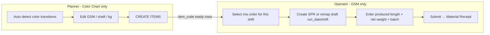

# Mix Roll in GSM — Decided Design (Updated)

## Locked decisions (from user)

| Decision | Choice |
|----------|--------|
| **WO validation block** | Skip `_validate_no_pending_wo_width_rows` **only** when `is_mix_roll=1`. Normal fabric SPRs stay strict. |
| **Who creates Items** | **Planner only** on Color Chart (`CREATE ITEMS`). Operator never creates items. |
| **Who creates SPR** | **Operator** (or operator selects an existing draft). Planner does **not** create SPRs — planning date ≠ production date/shift. |
| **Auto-assign mix SPR to shift** | **No.** Operator must **choose** which mix order runs this unit/shift. Timing can change anytime. |
| **Existing draft SPR** | Allowed: operator selects that mix → if draft SPR exists, **remap `run_date` / `shift` / `unit`** to current GSM session when they start entering data. |
| **Order / meter length** | **Unknown.** Shop floor only knows **produced length**. Do not require / invent order length (drop 800m default as “ordered length”). Planned kg may use produced length when entered. |
| **Option C (full lifecycle in GSM)** | **Rejected** — planning and production must stay separate. |
| **Option D (separate mix route)** | **Rejected** — everything for production stays in GSM; avoid extra pages. |
| **Approach** | **Efficient Option A** + operator-driven select/create (revised B — **not** auto-attach). |

---

## Urgent bug (unrelated to mix, blocking GSM now)

**API:** `get_gsm_shift_consolidated_summary`  
**Error:** `IndexError: list index out of range` on empty `order_codes`

```python
# unified_production_entry_api.py ~2549
key=lambda r: _cstr(r.get("order_codes", [""])[0]),  # fails when order_codes == []
```

**Fix:** Safe key, e.g. `_cstr((r.get("order_codes") or [""] or [""])[0] if (r.get("order_codes") or [""]) else "")` or:

```python
key=lambda r: _cstr((r.get("order_codes") or [""])[0] if (r.get("order_codes") or [""]) else "")
```

Better: `key=lambda r: _cstr(next(iter(r.get("order_codes") or []), ""))`

Ship this with the WO-validation fix in the first deploy.

---

## Roles (final)



| Role | Does | Does not |
|------|------|----------|
| **Planner** | Color Chart sequence, mix row GSM/shaft/kg, **CREATE ITEMS** | Create SPR, enter production, submit |
| **Operator** | Pick mix for shift, create/remap SPR, roll entry, submit in GSM | Create Item masters, plan Color Chart |

---

## Target GSM flow (efficient A)

1. Planner prepares mix row + items on Color Chart (any planning date).
2. Operator opens GSM for **Unit / Date / Shift**.
3. **Mix Rolls** panel lists **item-ready** mix rows for that **unit** (from `mix_roll_store_data`, not filtered by planning date as “must run today”).
4. Operator **selects** which mix order(s) to produce this shift.
5. GSM:
   - If no SPR → `create_mix_spr` with **current** `run_date` / `shift` / `unit`
   - If draft SPR exists → update `run_date` / `shift` / `unit` to session, then open for entry
6. Operator adds rolls: **produced length** + weights + batch (no ordered length field required).
7. Submit mix SPR → Material Receipt; Color Chart row `_submitted` + kg sync.

**Not done:** auto-attach SPR to session by date; planner STOCK ENTRY button as primary path (can remain for legacy desk, but GSM is operator path).

---

## WO validation (blocking now)

In [`shaft_production_run.py`](production_entry/production_planning/doctype/shaft_production_run/shaft_production_run.py):

```python
def _validate_production_submit_readiness(self):
    self._validate_no_duplicate_roll_batches()
    self._validate_produced_rows_have_batch_numbers()
    self._validate_batch_numbers_not_on_other_sprs()
    if not spr_doc_is_mix_roll(self):
        self._validate_no_pending_wo_width_rows()
```

Only mix rolls skip WO check. Fabric unchanged.

---

## Length / planned qty rules

- **Ordered length:** not known → do not show / require as mandatory; do not default 800m as “order length” in GSM UI.
- **Produced length:** operator enters (required for mix GSM calc if used).
- **Planned qty:** optional — if GSM + width + produced length present, use `compute_mix_roll_planned_qty_kg`; else leave blank / use Color Chart kg as target only.
- Shaft `meter_roll_mtrs` on create: leave empty or omit; do not invent 800.

---

## Rejected options (kept for context)

- **B auto-attach:** Rejected — planner SPR on wrong date confuses operators; shift unknown until production day.
- **C full in GSM:** Rejected — planning + production in one place is worse.
- **D separate route:** Rejected — duplicate UI/time; production stays in GSM.

---

## Implementation phases

### Phase 0 — Hotfixes (do first)

1. Fix `get_gsm_shift_consolidated_summary` empty `order_codes` sort key.
2. Skip WO pending validation only when `is_mix_roll=1`.

### Phase 1 — Discovery + operator select

- API: list mix rows for unit where `item_code` set and not `_submitted` (and optional draft `spr_name`).
- UI: Mix panel — multi-select / pick for this shift (same session unit).
- On pick: create SPR for session date/shift **or** remap existing draft SPR header fields.

### Phase 2 — Roll entry in GSM

- Mix grid: item, width, batch, produced length, net/gross — **no WO, no PP, no job wizard**.
- Reuse batch prefix from shift session.
- `save_gsm_roll_line` mix-aware path.

### Phase 3 — Submit

- `submit_gsm_mix_roll_spr` → existing `create_mix_roll_material_receipts`.
- Sync store `_submitted` + kg.
- Do not break fabric `submit_gsm_production_entry` PP→SPR path.

---

## Concept recap (unchanged)

Mix rolls = color-transition FG with **no PP/WO**, planned on Color Chart, stocked via **Material Receipt** on SPR submit (`is_mix_roll=1`). GSM today only feeds normal fabric orders from the chart — mix production must be added as a **select → produce** path beside fabric, not auto-scheduled.

## Summary

| Question | Answer |
|----------|--------|
| Who creates items? | Planner on Color Chart |
| Who creates SPR? | Operator in GSM (or remap draft) |
| Auto-assign by date/shift? | No — operator chooses |
| Order length? | Not used — produced length only |
| WO check? | Skipped only if `is_mix_roll` |
| Where to produce? | GSM Mix panel (not Option C/D) |
| First ship? | Consolidated summary crash + mix WO skip |
