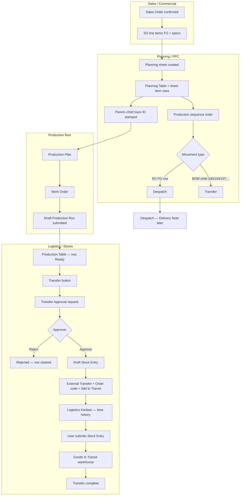

# Transfer logistics — end-to-end flow

Department-wise view from **Sales Order** through **transfer complete**. Use this with **Logistics Kanban**, **Production Table**, and **Transfer Approval**.

---

## Flowchart (department view)



---

## Step-by-step (user friendly)

| Step | Who | Where | What happens |
|------|-----|--------|----------------|
| 1 | Sales | Sales Order | Order confirmed; FG and BOM lines exist. |
| 2 | Planning | Planning sheet | Sheet generated; rows in **Planning Table** / **Items**. |
| 3 | Planning | Movement column | **Despatch** = sell/dispatch FG; **Transfer** = inter-company move (BOM children). |
| 4 | Planning | Trace ID | Children (100, 104 on 106 SO, etc.) inherit **parent FG trace**, not wrong 104-only id. |
| 5 | Production | Production Plan / WO | Plan and work orders per unit. |
| 6 | Production | SPR | Production run **submitted** when done. |
| 7 | Logistics | Production Table | **MOVEMENT** shows Despatch or Transfer → destination. |
| 8 | Logistics | Transfer dialog | Select rows (Transfer + SPR done), batches, **to company**. |
| 9 | Logistics | Transfer Approval | Request created → **Transfer Approval** page. |
| 10 | Manager | Transfer Approval | **Approve** → draft **Stock Entry** (FG → Goods In Transit). |
| 11 | Stores | Stock Entry | Check **External Transfer**, **Order code**, batches; **Submit**. |
| 12 | Logistics | Logistics Kanban | **Transfer history** on destination card (date, order, Draft/Submitted). |

---

## Movement type rules

- **Despatch** — Planning row is the **Sales Order finished good** (same SO line, same FG family e.g. 6002-106…).
- **Transfer** — BOM-extracted children (100, 104, 107, …) on that SO line.

---

## Logistics Kanban

- **Transfer** tab — truck animation toward customer; destination cards; **transfer history** (draft + submitted) with date and order code.
- **Despatch** tab — Delivery Note (coming soon).
- Filter: All / Draft STE only / Submitted STE only.

---

## After deploy

```bash
bench migrate
bench build --app production_entry
```

Re-stamp traces on a sheet if needed:

```python
frappe.call("production_entry.production_planning.scheduler_api.backfill_parent_child_trace_ids", {"planning_sheet_name": "PLAN-2026-01772"})
```

Re-apply movement types:

```python
# Runs on post-sync; or save planning sheet to trigger validate hooks
```
